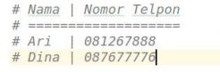
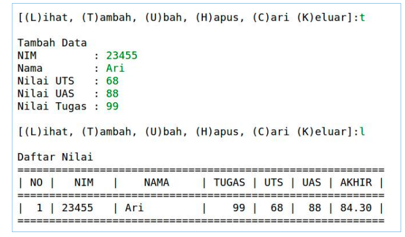
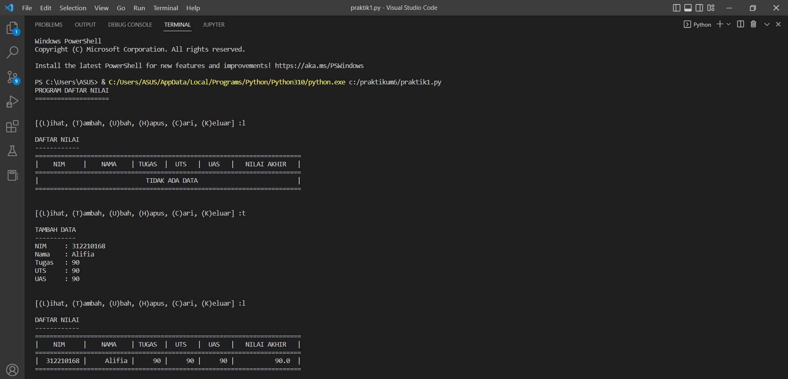
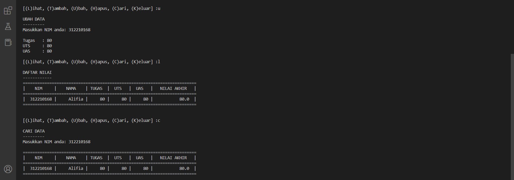
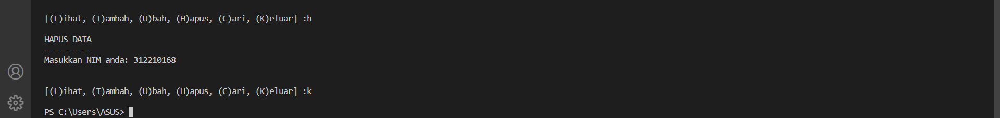

## praktikum6 

## Tugas Python Pertemuan ke 10

Nama: Alifia Ananda Putri

Nim: 312210168

Kelas: TI.22.A2

Mapel: Bahasa Pemrograman

## Latihan Module 1

Buat Dictionary daftar kontak:

• Nama sebagai key, dan nomor sebagai value

• Tampilkan kontaknya Ari

• Tambah kontak baru dengan nama Riko, nomor 087654544

• Ubah kontak Dina dengan nomor baru 088999776

• Tampilkan semua Nama

• Tampilkan semua Nomor

• Tampilkan daftar Nama dan nomornya

• Hapus kontak Dina

    # Buat Dictionary daftar kontak
    # (Note) Nama sebagai key, dan nomor sebagai value
    daftarKontak = {'Ari': '081267888', 'Dina': '081267888'}

    # Tampilkan kontaknya Ari
    print('Menampilkan Kontak Ari : ', daftarKontak['Ari'])

    # Tambah kontak baru dengan nama Riko, nomor 087654544
    daftarKontak['Rico'] = "087654544"
    # Ubah kontak Dina dengan nomor baru 088999776
    daftarKontak['Dina'] = "088999776"

    # Tampilkan semua Nama
    print(daftarKontak.keys())
    # Tampilkan semua Nomor
    print(daftarKontak.values())
    # Tampilkan daftar Nama dan nomornya
    print(daftarKontak.items())

    # Hapus kontak Dina
    del daftarKontak['Dina']
    print(daftarKontak.items())

    

## Tugas Praktikum

   Buat program sederhana yang akan menampilkan daftar nilai mahasiswa, dengan ketentuan :

• Program dibuat dengan menggunakan Dictionary

• Tampilkan menu pilihan: (Tambah Data, Ubah Data, Hapus Data, Tampilkan Data, Cari Data)

• Nilai Akhir diambil dari perhitungan 3 komponen nilai (tugas: 30%, uts: 35%, uas: 35%)

• Buat flowchart dan penjelasan programnya 

## Flowchart

## Code

print("PROGRAM DAFTAR NILAI")
print("====================")
print()
data={}
while True:
    print()
    a=input("[(L)ihat, (T)ambah, (U)bah, (H)apus, (C)ari, (K)eluar] :")
    print()

    if a=="t" or a=="T":
        print("TAMBAH DATA")
        print("-----------")
        nim=int(input("NIM\t: "))
        nama=input("Nama\t: ")
        tugas=int(input("Tugas\t: ")) 
        uts=int(input("UTS\t: "))
        uas=int(input("UAS\t: "))
        akhir=(int(tugas)*30/100)+(int(uts)*35/100)+(int(uas)*35/100)
        data[nim]=nama, tugas, uts, uas, akhir
        print()

    elif a=="l" or a=="L":
        if data.items():
            print("DAFTAR NILAI")
            print("------------")
            print(72*"=")
            print("| {0:^10} | {1:^10} | {2:^6} | {3:^6} | {4:^6} |   {5:^12}  |".format("NIM", "NAMA", "TUGAS", "UTS", "UAS", "NILAI AKHIR"))
            print(72*"=")
            for item in data.items(): 
                print("| {0:>10} | {1:>10} | {2:>6} | {3:>6} | {4:>6} |   {5:>12}  |".format(nim, nama, tugas, uts, uas, akhir))
                print(72*"=")
            print()
        else:
            print("DAFTAR NILAI")
            print("------------")
            print(72*"=")
            print("| {0:^10} | {1:^10} | {2:^6} | {3:^6} | {4:^6} |   {5:^12}  |".format("NIM", "NAMA", "TUGAS", "UTS", "UAS", "NILAI AKHIR"))
            print(72*"=")
            print("|                             TIDAK ADA DATA                           |")
            print(72*"=")
            print()

    elif a=="u" or a=="U":
        print("UBAH DATA")
        print("---------")
        b=input("Masukkan NIM anda: ")
        print()
        if data.keys():
            tugas=int(input("Tugas\t: ")) 
            uts=int(input("UTS\t: "))
            uas=int(input("UAS\t: "))
            akhir=(int(tugas)*30/100)+(int(uts)*35/100)+(int(uas)*35/100)

    elif a=="h" or a=="H":
        print("HAPUS DATA")
        print("----------")
        b=input("Masukkan NIM anda: ")
        print()
        if data.keys():
            del data[nim]
                   
    elif a=="c" or a=="C":
        print("CARI DATA")
        print("---------")
        b=input("Masukkan NIM anda: ")
        print()
        if data.keys():
            print(72*"=")
            print("| {0:^10} | {1:^10} | {2:^6} | {3:^6} | {4:^6} |   {5:^12}  |".format("NIM", "NAMA", "TUGAS", "UTS", "UAS", "NILAI AKHIR"))
            print(72*"=")
            print("| {0:>10} | {1:>10} | {2:>6} | {3:>6} | {4:>6} |   {5:>12}  |".format(nim, nama, tugas, uts, uas, akhir))
            print(72*"=")
            print()
            
    elif a=="k" or a=="K":
         break

## Hasil Running Program

